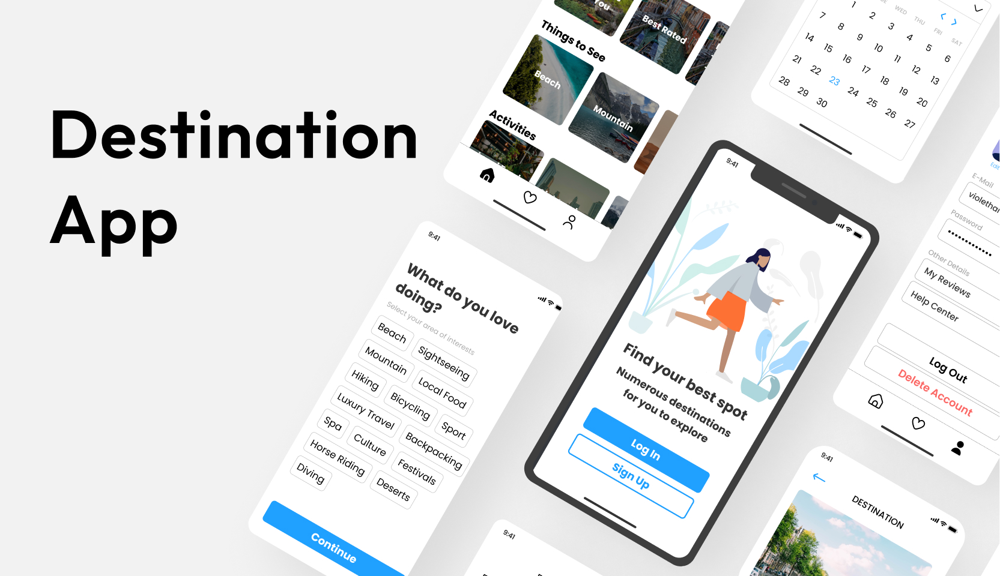

# Travelio Destination App

Travel destination app project created to help users discover and choose places to travel through thoughtful UX planning and visually engaging UI design.

## Project Overview

With so many destinations to choose from around the world, deciding where to travel can often feel overwhelming. Users may struggle to compare options and find places that truly match their interests and preferences.

Travelio is a digital solution that brings destinations together in one app, helping users discover and choose where to travel based on their personal preferences. The goal is to make travel planning easier, more personalized, and more enjoyable.

## Repository Contents

- **UI Layouts/** – final app screens
- **Wireframes/** – early wireframe explorations
- **Design System/** – colors, typography, iconography and components
- **UX/** – problem statement, user flow, user persona, and wireframes PDF
- **Cover.jpg** – project cover image
- **UI Layouts.jpg** – UI preview image
- **Wireframes.jpg** – wireframes preview image

## Tools Used

Figma  

## Project Goal

To design a modern destination app that combines strong visual design with clear user experience thinking, making travel discovery more intuitive, personalized, and enjoyable.

## Type of Project

UI/UX Design  
Portfolio Project
